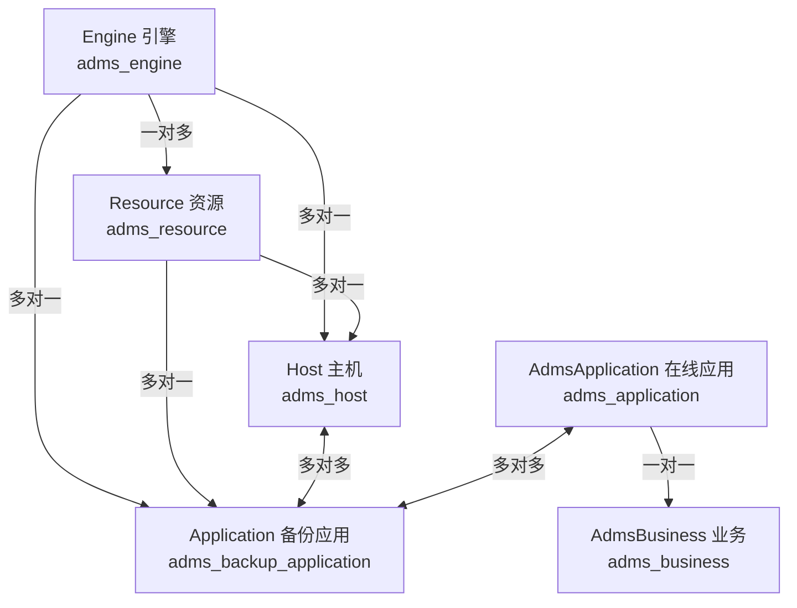
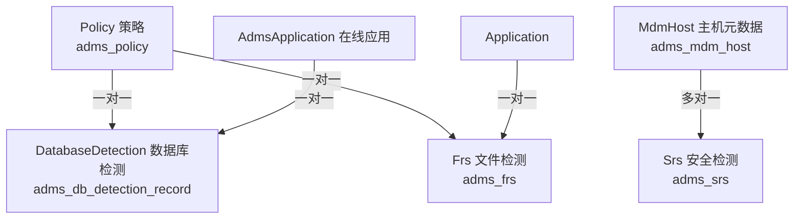
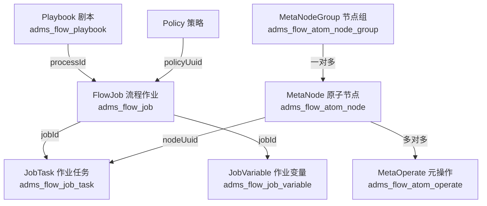
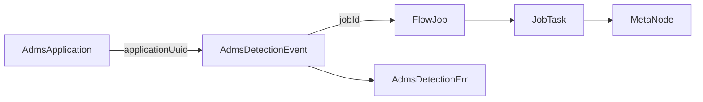

# ADMS 项目数据血缘模型分析报告

> 分析日期: 2026-03-28
> 项目路径: C:\code\adms
> 分析范围: 实体类、流程定义、数据流转关系

---

## 目录

1. [流程定义结构](#一流程定义结构)
2. [实体类详细分析](#二实体类详细分析)
3. [实体关联关系汇总](#三实体关联关系汇总)
4. [流程结构总结](#四流程结构总结)
5. [核心数据血缘关系图](#五核心数据血缘关系图)
6. [数据流转血缘](#六数据流转血缘)

---

## 一、流程定义结构

### 1.1 Flow (流程定义 - 非JPA实体)

**文件位置:** `adms-commond/src/main/java/com/activeio/adms/data/flow/Flow.java`

| 字段 | 类型 | 说明 |
|------|------|------|
| name | String | 流程名称 |
| key | String | 流程关键字 |
| type | Integer | 类型 |
| nodes | List\<FlowNode\> | 流程节点列表 |
| links | List\<FlowLink\> | 流程连接列表 |
| listeners | List\<Listener\> | 监听器列表 |
| criteriaForSuccess | String | 成功标准 |

**结构关系:**
```
Flow ─┬─ 一对多 → FlowNode (nodes字段)
      └─ 一对多 → FlowLink (links字段)
```

---

### 1.2 FlowNode (流程节点)

**文件位置:** `adms-commond/src/main/java/com/activeio/adms/data/flow/FlowNode.java`

| 字段 | 类型 | 说明 |
|------|------|------|
| id | String | 节点ID |
| key | String | 节点关键字 |
| name | String | 节点名称 |
| type | Integer | 节点类型 |
| params | Map\<String, Object\> | 参数 |
| skipCondition | String | 跳过条件 |
| libParallel | Integer | CPU核数 |
| failedExecution | Boolean | 失败执行标志 |
| listeners | List\<Listener\> | 监听器列表 |

**子类型:** FlowQueueNode (type=5)

---

### 1.3 FlowLink (流程连接)

**文件位置:** `adms-commond/src/main/java/com/activeio/adms/data/flow/FlowLink.java`

| 字段 | 类型 | 说明 |
|------|------|------|
| source | String | 源节点ID |
| target | String | 目标节点ID |

**连接关系:**
```
FlowNode.id ←──→ FlowLink.source
FlowNode.id ←──→ FlowLink.target
```

---

## 二、实体类详细分析

### 2.1 核心应用实体

#### Application (备份应用)

| 属性 | 值 |
|------|-----|
| **表名** | adms_backup_application |
| **文件位置** | adms-core/.../engine/entity/Application.java |
| **主键** | uuid |

**关键字段:**
- name: 名称
- type: 类型
- engineId: 引擎ID
- resourceId: 资源ID
- config: JSON配置
- status: 状态
- engineType: 引擎类型

**关联关系:**
```
Application ─┬─ 多对一 → Engine (engineId)
             ├─ 多对一 → Resource (resourceId)
             ├─ 多对多 → Host (adms_host_application_relation)
             └─ 多对多 → AdmsBusiness (adms_business_check_service)
```

---

#### AdmsApplication (应用管理)

| 属性 | 值 |
|------|-----|
| **表名** | adms_application |
| **文件位置** | adms-core/.../application/entity/AdmsApplication.java |
| **主键** | uuid |

**关键字段:**
- type: 类型
- name: 名称
- address: 地址
- version: 版本
- access: 计算访问资源
- attribute: 应用属性
- targetData: 目标数据
- dataSize: 目标数据量大小
- status: 状态
- backupUuids: 备份UUIDs
- category: 类别
- osType: 操作系统类型
- businessUuid: 业务UUID

**关联关系:**
```
AdmsApplication ─┬─ 一对一 → AdmsBusiness (businessUuid)
                 └─ 多对多 → Application (adms_application_backup_relation)
```

---

#### Host (主机)

| 属性 | 值 |
|------|-----|
| **表名** | adms_host |
| **文件位置** | adms-core/.../engine/entity/Host.java |
| **主键** | uuid |

**关键字段:**
- name: 名称
- ip: IP地址
- osType: 操作系统类型
- osRelease: 操作系统发行版
- osVersion: 操作系统版本
- status: 状态
- engineId: 引擎ID
- resourceId: 资源ID
- hostType: 主机类型
- clusterId: 集群ID

**关联关系:**
```
Host ─┬─ 多对一 → Engine (engineId)
      └─ 多对一 → Resource (resourceId)
```

---

#### Engine (引擎)

| 属性 | 值 |
|------|-----|
| **表名** | adms_engine |
| **文件位置** | adms-core/.../engine/entity/Engine.java |
| **主键** | uuid |

**关键字段:**
- type: 引擎类型
- name: 名称
- ip: IP地址
- port: 端口
- username: 同步账号
- password: 同步密码
- status: 状态
- version: 版本
- syncStatus: 同步状态
- xxlJobId: xxl-job ID

**关联关系:**
```
Engine ─ 一对多 → Resource (engine_id)
```

---

#### Resource (资源)

| 属性 | 值 |
|------|-----|
| **表名** | adms_resource |
| **文件位置** | adms-core/.../engine/entity/Resource.java |
| **主键** | uuid |

**关键字段:**
- type: 类型
- name: 名称
- config: 配置
- ip: IP地址
- engineId: 引擎ID
- status: 状态

---

### 2.2 业务实体

#### AdmsBusiness (业务)

| 属性 | 值 |
|------|-----|
| **表名** | adms_business |
| **文件位置** | adms-core/.../business/entity/AdmsBusiness.java |
| **主键** | uuid |

**关键字段:**
- name: 名称
- businessLevel: 业务等级

---

#### AdmsBusinessCheckService (业务检测服务关系)

| 属性 | 值 |
|------|-----|
| **表名** | adms_business_check_service |
| **文件位置** | adms-core/.../business/entity/AdmsBusinessCheckService.java |
| **主键** | uuid |

**关键字段:**
- businessUuid: 业务UUID
- type: 检测方法类型
- resourceId: 资源UUID

**关联关系:**
```
AdmsBusinessCheckService ─┬─ → AdmsBusiness (businessUuid)
                          └─ → Application (多对多中间表)
```

---

### 2.3 流程作业实体

#### Playbook (流程剧本)

| 属性 | 值 |
|------|-----|
| **表名** | adms_flow_playbook |
| **文件位置** | adms-core/.../playbook/entity/Playbook.java |
| **主键** | uuid |

**关键字段:**
- name: 作业名称
- businessKey: 流程图关键字
- type: 作业类型
- policyUuid: 策略ID
- viewData: 前端显示数据
- dag: 二进制流程数据
- criteriaForSuccess: 成功标准
- version: 版本
- status: 状态

---

#### FlowJob (流程作业)

| 属性 | 值 |
|------|-----|
| **表名** | adms_flow_job |
| **文件位置** | adms-core/.../playbook/entity/FlowJob.java |
| **主键** | uuid |

**关键字段:**
- name: 作业名称
- businessKey: 流程图关键字
- type: 作业类型
- category: 作业类别
- id: 作业编号
- runType: 运行类型
- obj: 作业对象
- startTime/endTime: 开始/结束时间
- progress: 进度
- status: 运行状态
- policyUuid: 策略ID
- processInstanceId: 流程实例ID
- processId: 流程ID

**关联关系:**
```
FlowJob ─┬─ → Playbook (processId)
         └─ → Policy (policyUuid)
```

---

#### JobTask (作业任务)

| 属性 | 值 |
|------|-----|
| **表名** | adms_flow_job_task |
| **文件位置** | adms-core/.../sharding/flow/JobTask.java |
| **主键** | uuid |

**关键字段:**
- jobId: 作业ID
- nodeId: 节点ID
- nodeKey: 节点关键字
- name: 名称
- startTime/endTime: 开始/结束时间
- status: 状态
- activityId: 流程引擎任务ID
- instanceId: 流程任务实例ID
- host: 执行主机
- nodeUuid: 原子节点UUID

**关联关系:**
```
JobTask ─┬─ 多对一 → FlowJob (jobId)
         └─ 多对一 → MetaNode (nodeUuid)
```

---

#### JobVariable (作业变量)

| 属性 | 值 |
|------|-----|
| **表名** | adms_flow_job_variable |
| **文件位置** | adms-core/.../sharding/flow/JobVariable.java |
| **主键** | uuid |

**关键字段:**
- jobId: 作业ID
- nodeId: 节点ID
- taskId: 任务ID
- jobTaskUuid: 作业任务UUID
- label: 标签
- field: 字段
- value: 值
- type: 类型
- display: 显示状态

---

### 2.4 原子节点实体

#### MetaNode (原子节点)

| 属性 | 值 |
|------|-----|
| **表名** | adms_flow_atom_node |
| **文件位置** | adms-core/.../playbook/entity/MetaNode.java |
| **主键** | uuid |

**关键字段:**
- name: 名称
- key: 关键字
- specifications: 参数说明
- parameters: 对外参数
- returns: 返回值
- viewData: 前端显示
- version: 版本

**关联关系:**
```
MetaNode ─┬─ 多对一 → MetaNodeGroup (node_group_uuid)
          └─ 多对多 → MateNodeOperate (adms_flow_atom_operate_node)
```

---

#### MetaNodeGroup (原子节点组)

| 属性 | 值 |
|------|-----|
| **表名** | adms_flow_atom_node_group |
| **文件位置** | adms-core/.../playbook/entity/MetaNodeGroup.java |
| **主键** | uuid |

**关键字段:**
- name: 名称

**关联关系:**
```
MetaNodeGroup ─ 一对多 → MetaNode
```

---

#### MetaOperate (元操作)

| 属性 | 值 |
|------|-----|
| **表名** | adms_flow_atom_operate |
| **文件位置** | adms-core/.../playbook/entity/MetaOperate.java |
| **主键** | uuid |

**关键字段:**
- type: 类型
- name: 名称
- key: 关键字
- content: 内容
- params: 参数列表
- returns: 返回值列表
- version: 版本

---

#### MateNodeOperate (节点操作关联)

| 属性 | 值 |
|------|-----|
| **表名** | adms_flow_atom_operate_group |
| **文件位置** | adms-core/.../playbook/entity/MateNodeOperate.java |
| **主键** | uuid |

**关键字段:**
- taskId: 任务ID
- host: 主机
- serial: 序号

**关联关系:**
```
MateNodeOperate ─ 多对一 → MetaOperate (operate_id)
```

---

### 2.5 检测服务实体

#### DatabaseDetection (数据库检测记录)

| 属性 | 值 |
|------|-----|
| **表名** | adms_db_detection_record |
| **文件位置** | adms-core/.../drs/entity/DatabaseDetection.java |
| **主键** | uuid |

**关键字段:**
- name: 名称
- type: 类型 (0=生产, 1=AGM, 2=NBU)
- attendedMode: 连接方式
- rapidTest: 快速检测
- randomDetection: 随机检测
- staticDetecting: 静态检测
- deepInspection: 深度检测
- algorithm: 规范识别/加密洞察
- policy: 策略ID
- status: 状态
- applicationId: 备份对象ID/在线应用ID
- admsApplicationId: ADMS应用ID
- admcIp: 执行主机
- image: 备份检测镜像
- imageHost: 镜像主机

**关联关系:**
```
DatabaseDetection ─┬─ 一对一 → AdmsApplication (admsApplicationId)
                   └─ 一对一 → Policy (policy)
```

---

#### Frs (文件检测服务)

| 属性 | 值 |
|------|-----|
| **表名** | adms_frs |
| **文件位置** | adms-core/.../frs/entity/Frs.java |
| **主键** | uuid |

**关键字段:**
- name: 名称
- osType: 操作系统类型
- fullPolicyId: 全量策略ID
- incrementPolicyId: 增量策略ID
- fromType: 来源类型
- applicationId: 应用ID
- admsApplicationId: ADMS应用ID
- status: 状态

**关联关系:**
```
Frs ─┬─ 一对一 → Policy (fullPolicyId, 全量策略)
     ├─ 一对一 → Policy (incrementPolicyId, 增量策略)
     └─ 一对一 → Application (applicationId)
```

---

#### Srs (安全检测服务)

| 属性 | 值 |
|------|-----|
| **表名** | adms_srs |
| **文件位置** | adms-core/.../srs/entity/Srs.java |
| **主键** | uuid |

**关键字段:**
- name: 名称
- mdmHostId: MDM主机ID
- policyId: 策略ID
- status: 状态

**关联关系:**
```
Srs ─ 多对一 → MdmHost (mdmHostId)
```

---

### 2.6 检测事件与结果

#### AdmsDetectionEvent (检测事件)

| 属性 | 值 |
|------|-----|
| **表名** | adms_detection_event |
| **文件位置** | adms-core/.../sharding/event/AdmsDetectionEvent.java |
| **主键** | uuid |

**关键字段:**
- businessType: 业务类型 (1=文件检测, 3=数据库检测)
- eventId: 事件ID
- jobId: 任务ID
- detectResultUuid: 检测结果ID
- applicationUuid: 应用UUID
- filePath: 文件全路径/数据库表路径
- databaseName: 数据库名称
- schemaName: Schema名称
- tableName: 表名
- status: 状态

**关联关系:**
```
AdmsDetectionEvent ─ 多对一 → AdmsApplication (applicationUuid)
```

---

#### AdmsDetectionErr (检测结果错误)

| 属性 | 值 |
|------|-----|
| **表名** | adms_detection_err |
| **文件位置** | adms-core/.../sharding/drs/AdmsDetectionErr.java |
| **主键** | uuid |

**关键字段:**
- jobId: 作业ID
- ip: 主机IP
- type: 检测类型 (1=抽样, 2=随机, 3=深度, 4=静态, 5=快速)
- databaseName: 数据库名
- schemaName: Schema名
- tableName: 表名
- result: 结果状态码
- checkSource: 检测源
- appId: 应用ID

---

### 2.7 策略实体

#### Policy (策略)

| 属性 | 值 |
|------|-----|
| **表名** | adms_policy |
| **文件位置** | adms-core/.../policy/entity/Policy.java |
| **主键** | uuid |

**关键字段:**
- name: 名称
- cron: cron表达式
- cycle: 调度周期
- rate: 调度频率
- startTime/endTime: 开始/结束时间
- xxlJobId: 关联xxl-job
- status: 状态

---

#### PolicyAppRelation (策略应用关系)

| 属性 | 值 |
|------|-----|
| **表名** | adms_policy_app_relation |
| **文件位置** | adms-core/.../policy/entity/PolicyAppRelation.java |
| **主键** | uuid |

**关键字段:**
- policyUuid: 策略UUID
- appUuid: 应用UUID
- type: 类型

**关联关系:**
```
PolicyAppRelation ─┬─ → Policy (policyUuid)
                   └─ → AdmsApplication (appUuid)
```

---

### 2.8 权限实体

#### User (用户)

| 属性 | 值 |
|------|-----|
| **表名** | adms_user |
| **文件位置** | adms-core/.../permission/entity/User.java |
| **主键** | uuid |

**关键字段:**
- username: 用户名
- password: 密码
- email: 邮箱
- mobile: 手机号
- userStatus: 用户状态
- initStatus: 初始状态

---

#### Role (角色)

| 属性 | 值 |
|------|-----|
| **表名** | adms_role |
| **文件位置** | adms-core/.../permission/entity/Role.java |
| **主键** | uuid |

**关键字段:**
- name: 角色名称

---

#### UserRole (用户角色关系)

| 属性 | 值 |
|------|-----|
| **表名** | adms_user_role |
| **文件位置** | adms-core/.../permission/entity/UserRole.java |
| **主键** | uuid |

**关键字段:**
- userId: 用户ID
- roleId: 角色ID

**关联关系:**
```
UserRole ─┬─ → User (userId)
          └─ → Role (roleId)
```

---

#### Organization (组织)

| 属性 | 值 |
|------|-----|
| **表名** | adms_org |
| **文件位置** | adms-core/.../permission/entity/Organization.java |
| **主键** | uuid |

**关键字段:**
- name: 组织名称

---

#### UserOrganization (用户组织关系)

| 属性 | 值 |
|------|-----|
| **表名** | adms_user_org |
| **文件位置** | adms-core/.../permission/entity/UserOrganization.java |
| **主键** | uuid |

**关键字段:**
- userId: 用户ID
- orgId: 组织ID

---

#### Menu (菜单)

| 属性 | 值 |
|------|-----|
| **表名** | adms_menu |
| **文件位置** | adms-core/.../permission/entity/Menu.java |
| **主键** | uuid |

**关键字段:**
- code: 菜单前端唯一标识
- name: 菜单名称
- parentCode: 父菜单标识

---

#### RoleMenu (角色菜单关系)

| 属性 | 值 |
|------|-----|
| **表名** | adms_role_menu |
| **文件位置** | adms-core/.../permission/entity/RoleMenu.java |
| **主键** | uuid |

**关键字段:**
- roleId: 角色ID
- menuId: 菜单ID

---

#### RoleAction (角色功能关系)

| 属性 | 值 |
|------|-----|
| **表名** | adms_role_action |
| **文件位置** | adms-core/.../permission/entity/RoleAction.java |
| **主键** | uuid |

**关键字段:**
- roleId: 角色ID
- actionCode: 功能code

---

#### Action (功能)

| 属性 | 值 |
|------|-----|
| **表名** | adms_action |
| **文件位置** | adms-core/.../permission/entity/Action.java |
| **主键** | uuid |

**关键字段:**
- name: 按钮名称
- code: 按钮前端标识

---

### 2.9 MDM实体

#### MdmHost (主机元数据)

| 属性 | 值 |
|------|-----|
| **表名** | adms_mdm_host |
| **文件位置** | adms-core/.../mdm/entity/MdmHost.java |
| **主键** | uuid |

**关键字段:**
- ipaddress: 主机IP地址
- hostName: 主机名
- osRelease: OS发行版本
- osType: OS类型
- osKernelVersion: OS内核版本
- cpuType/Number: CPU类型/数量
- memoryTotal: 内存总数
- engineHostId: 引擎主机ID
- installStatus: Agent安装状态

---

#### MdmApplication (应用元数据)

| 属性 | 值 |
|------|-----|
| **表名** | adms_mdm_application |
| **文件位置** | adms-core/.../mdm/entity/MdmApplication.java |
| **主键** | uuid |

**关键字段:**
- mdmHostId: MDM主机ID
- hostIp: 主机IP
- type: 应用类型
- instance: 实例地址
- version: 应用版本号
- dbUser: 登录用户

**关联关系:**
```
MdmApplication ─ 多对一 → MdmHost (mdmHostId)
```

---

#### MdmHostAppRelation (主机应用关系)

| 属性 | 值 |
|------|-----|
| **表名** | adms_mdm_host_app_relation |
| **文件位置** | adms-core/.../mdm/entity/MdmHostAppRelation.java |
| **主键** | id |

**关键字段:**
- hostId: 主机ID
- applicationId: 应用ID

---

### 2.10 其他重要实体

#### BackupJob (备份作业)

| 属性 | 值 |
|------|-----|
| **表名** | adms_backup_job |
| **文件位置** | adms-core/.../restore/entity/BackupJob.java |
| **主键** | uuid |

**关键字段:**
- jobId: 作业ID
- userName: 用户名
- startTime/endTime: 开始/结束时间
- scope: 范围
- path: 路径
- size: 大小
- status: 状态
- launchType: 启动类型

**关联关系:**
```
BackupJob ─ 一对一 → FlowJob (jobId)
```

---

#### MirrorImage (镜像)

| 属性 | 值 |
|------|-----|
| **表名** | adms_mirror_image |
| **文件位置** | adms-core/.../image/entity/MirrorImage.java |
| **主键** | uuid |

**关键字段:**
- name: 名称
- applicationId: 应用ID
- reportType: 报告类型
- engineId: 引擎ID
- expirationDate: 过期日期
- backupDate: 备份日期

**关联关系:**
```
MirrorImage ─┬─ 一对一 → Application (applicationId)
             ├─ 一对一 → AdmsApplication (applicationId)
             └─ 多对一 → Engine (engineId)
```

---

#### WhiteList (白名单)

| 属性 | 值 |
|------|-----|
| **表名** | adms_white_list |
| **文件位置** | adms-core/.../white/entity/WhiteList.java |
| **主键** | uuid |

**关键字段:**
- value: 白名单值
- name: 名称
- type: 类型
- reportType: 报告类型
- checkType: 检测类型
- checkUuid: 检测UUID
- applicationId: 应用ID

---

#### DrsBaseline (DRS基线)

| 属性 | 值 |
|------|-----|
| **表名** | adms_drs_baseline |
| **文件位置** | adms-core/.../drs/entity/DrsBaseline.java |
| **主键** | uuid |

**关键字段:**
- drsUuid: DRS UUID
- baselineJobId: 基线作业ID
- applicationId: 应用ID
- baselineTotal: 基线总数

**关联关系:**
```
DrsBaseline ─ 一对一 → AdmsApplication (applicationId)
```

---

#### AdmsDatabaseAnalysis (数据库分析)

| 属性 | 值 |
|------|-----|
| **表名** | adms_database_analysis |
| **文件位置** | adms-core/.../analysis/entity/AdmsDatabaseAnalysis.java |
| **主键** | uuid |

**关键字段:**
- drsDataUuid: DRS数据UUID
- database: 数据库
- schemaName: Schema名
- tableName: 表名
- isEncrypted: 是否加密
- jobId: 作业ID
- capacity: 容量

---

#### Email (邮件)

| 属性 | 值 |
|------|-----|
| **表名** | adms_email |
| **文件位置** | adms-core/.../email/entity/Email.java |
| **主键** | uuid |

**关键字段:**
- jobId: 作业ID
- businessName: 业务名称
- serviceName: 服务名称
- applicationId: 应用ID
- businessUuid: 业务UUID

---

#### Notification (通知)

| 属性 | 值 |
|------|-----|
| **表名** | adms_notification |
| **文件位置** | adms-core/.../notification/Notification.java |
| **主键** | uuid |

**关键字段:**
- content: 内容
- suggestion: 建议
- destination: 目的地
- destinationId: 目的地ID
- type: 类型
- jobId: 作业ID

---

#### Log (日志)

| 属性 | 值 |
|------|-----|
| **表名** | adms_log |
| **文件位置** | adms-core/.../log/entity/Log.java |
| **主键** | uuid |

**关键字段:**
- traceId: 追踪ID
- module: 模块
- type: 类型
- status: 状态
- description: 描述
- message: 消息
- ip: IP地址
- apiUrl: API URL
- level: 级别
- operator: 操作人

---

## 三、实体关联关系汇总

### 3.1 一对一关系

| 源实体 | 目标实体 | 关联字段 | 说明 |
|--------|----------|----------|------|
| AdmsApplication | AdmsBusiness | businessUuid | 应用归属业务 |
| DatabaseDetection | AdmsApplication | admsApplicationId | 检测关联应用 |
| DatabaseDetection | Policy | policy | 检测关联策略 |
| Frs | Policy | fullPolicyId | 全量策略 |
| Frs | Policy | incrementPolicyId | 增量策略 |
| MirrorImage | Application | applicationId | 镜像关联备份应用 |
| MirrorImage | AdmsApplication | applicationId | 镜像关联在线应用 |
| BackupJob | FlowJob | jobId | 备份作业关联流程 |
| DrsBaseline | AdmsApplication | applicationId | 基线关联应用 |
| AdmsDrsData | AdmsApplication | applicationId | DRS数据关联应用 |

---

### 3.2 一对多关系

| 源实体 | 目标实体 | 关联字段 | 说明 |
|--------|----------|----------|------|
| Engine | Resource | engine_id | 引擎下的资源 |
| MetaNodeGroup | MetaNode | node_group_uuid | 节点组下的节点 |

---

### 3.3 多对一关系

| 源实体 | 目标实体 | 关联字段 | 说明 |
|--------|----------|----------|------|
| Host | Engine | engineId | 主机归属引擎 |
| Host | Resource | resourceId | 主机归属资源 |
| Application | Engine | engineId | 应用归属引擎 |
| Application | Resource | resourceId | 应用归属资源 |
| JobTask | FlowJob | jobId | 任务归属作业 |
| JobTask | MetaNode | nodeUuid | 任务关联原子节点 |
| MateNodeOperate | MetaOperate | operate_id | 操作关联元操作 |
| Srs | MdmHost | mdmHostId | 安全检测关联主机 |
| AdmsDetectionEvent | AdmsApplication | applicationUuid | 事件归属应用 |
| MirrorImage | Engine | engineId | 镜像归属引擎 |

---

### 3.4 多对多关系

| 实体A | 实体B | 中间表 | 说明 |
|-------|-------|--------|------|
| Application | Host | adms_host_application_relation | 应用-主机关联 |
| AdmsApplication | Application | adms_application_backup_relation | 在线应用-备份应用关联 |
| Application | AdmsBusiness | adms_business_check_service | 应用-业务关联 |
| MetaNode | MateNodeOperate | adms_flow_atom_operate_node | 原子节点-操作关联 |

---

### 3.5 中间关系表汇总

| 关系表 | 实体A | 实体B | 说明 |
|--------|-------|-------|------|
| HostApplicationRelation | Host | Application | 主机-应用关联 |
| PolicyAppRelation | Policy | AdmsApplication | 策略-应用关联 |
| UserRole | User | Role | 用户-角色关联 |
| UserOrganization | User | Organization | 用户-组织关联 |
| RoleMenu | Role | Menu | 角色-菜单关联 |
| RoleAction | Role | Action | 角色-功能关联 |
| MdmHostAppRelation | MdmHost | Application | MDM主机-应用关联 |
| AdmsBusinessCheckService | AdmsBusiness | Application | 业务-应用关联 |

---

## 四、流程结构总结

### 4.1 流程定义层级

```
Flow (流程)
  │
  ├── nodes: List<FlowNode> (节点列表)
  │     │
  │     └── FlowNode
  │           ├── id: 节点唯一标识
  │           ├── key: 节点关键字
  │           ├── name: 节点名称
  │           ├── type: 节点类型
  │           ├── params: Map<String, Object> 参数
  │           └── listeners: List<Listener> 监听器
  │
  └── links: List<FlowLink> (连接列表)
        │
        └── FlowLink
              ├── source: FlowNode.id (源节点)
              └── target: FlowNode.id (目标节点)
```

---

### 4.2 流程执行层级

```
Playbook (流程剧本)
  │
  └── FlowJob (流程作业实例)
        │
        ├── processId → Playbook.uuid (关联剧本)
        ├── policyUuid → Policy.uuid (关联策略)
        │
        └── JobTask (任务列表)
              │
              ├── jobId → FlowJob.id (归属作业)
              └── nodeUuid → MetaNode.uuid (关联原子节点)
```

---

### 4.3 原子节点层级

```
MetaNodeGroup (节点组)
  │
  └── MetaNode (原子节点)
        │
        └── MateNodeOperate (节点操作)
              │
              └── MetaOperate (元操作)
```

---

## 五、核心数据血缘关系图

### 5.1 应用资源层级



### 5.2 检测服务层级



### 5.3 流程作业层级



### 5.4 检测事件血缘



---

## 六、数据流转血缘

### 6.1 字段级数据流转

| 数据源 | 流转路径 | 数据目标 | 说明 |
|--------|----------|----------|------|
| Policy | policyUuid → Frs.fullPolicyId | 文件检测配置 | 策略驱动检测 |
| Policy | policyUuid → DatabaseDetection.policy | 数据库检测配置 | 策略驱动检测 |
| Frs | uuid → FrsJob.frsUuid | 文件检测作业 | 配置触发作业 |
| DatabaseDetection | uuid → DatabaseDetectionDetail.databaseDetectionUuid | 检测作业详情 | 配置触发作业 |
| AdmsApplication | uuid → DatabaseDetection.admsApplicationId | 数据库连接信息 | 应用提供数据源 |
| AdmsApplication | uuid → Frs.admsApplicationId | 文件系统信息 | 应用提供数据源 |
| FlowJob | id → 各作业.jobId | 执行状态 | 作业状态同步 |
| Playbook | uuid → FlowJob.processId | 流程定义 | 剧本定义流程 |
| MdmHost | id → Srs.mdmHostId | 主机信息 | 主机安全检测目标 |
| Engine | id → Host/Application.engineId | 引擎归属 | 资源归属管理 |
| Resource | id → Host/Application.resourceId | 资源归属 | 资源归属管理 |

---

### 6.2 核心血缘枢纽节点

| 节点 | 类型 | 血缘特点 |
|------|------|----------|
| **FlowJob** | 流程作业 | 所有作业类型的汇聚点，是任务执行的统一入口 |
| **AdmsApplication** | 在线应用 | 业务数据的核心载体，连接业务、备份、检测的多向关系 |
| **Policy** | 策略 | 检测规则的源头，驱动 FRS/DRS/SRS 等检测服务 |
| **Engine** | 引擎 | 资源的物理归属，管理 Host/Application/Resource |
| **MdmHost** | MDM主机 | 主机安全检测的目标对象 |
| **Playbook** | 剧本 | 流程定义的源头，定义作业执行逻辑 |

---

### 6.3 数据流向规律

```
策略驱动模式:
Policy → 检测配置(Frs/DatabaseDetection/Srs) → 检测作业 → FlowJob → Playbook

应用资源模式:
Business → AdmsApplication → 备份应用(Application) → Engine/Host → Resource

流程执行模式:
Playbook → FlowJob → JobTask → MetaNode → MetaOperate

事件溯源模式:
AdmsApplication → AdmsDetectionEvent → AdmsDetectionErr
                                    ↓
                                  FlowJob
```

---

## 附录：实体统计

| 分类 | 数量 | 主要实体 |
|------|------|----------|
| 核心应用 | 5 | Application, AdmsApplication, Host, Engine, Resource |
| 业务 | 2 | AdmsBusiness, AdmsBusinessCheckService |
| 流程作业 | 6 | Playbook, FlowJob, FlowJobDag, JobTask, JobVariable |
| 原子节点 | 4 | MetaNode, MetaNodeGroup, MetaOperate, MateNodeOperate |
| 检测服务 | 3 | DatabaseDetection, Frs, Srs |
| 检测事件 | 2 | AdmsDetectionEvent, AdmsDetectionErr |
| 策略 | 2 | Policy, PolicyAppRelation |
| 权限 | 8 | User, Role, UserRole, Organization, UserOrganization, Menu, RoleMenu, RoleAction, Action |
| MDM | 3 | MdmHost, MdmApplication, MdmHostAppRelation |
| 其他 | 8 | BackupJob, MirrorImage, WhiteList, DrsBaseline, AdmsDatabaseAnalysis, Email, Notification, Log |

**实体总数: 43个**

---

*报告生成完成*
